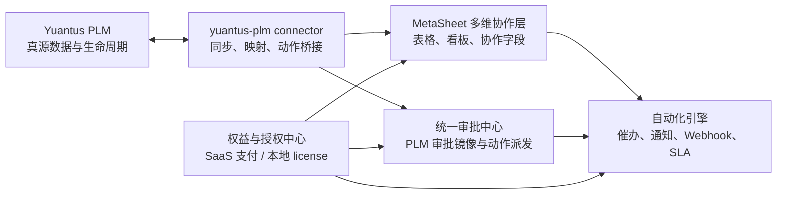

# PLM Collaboration And Automation Edition Development Plan

Date: 2026-06-02

Type: **Doc-only design plan + gated TODO.** 把现有 Yuantus PLM 升级为带"多维协作表 +
审批自动化 + 场景内升级"的 PLM 产品版本，**不重做 PLM 内核 / 多维表 / 审批引擎**。
**本文档不授权任何实现** —— 每个 Phase 都是一次独立显式 opt-in。

文档归属：**Yuantus 是 PLM 产品真源与本计划主文档归属**；MetaSheet2 是多维协作、
审批自动化、授权能力的**实现依赖**（其侧仅保留短引用，见 `metasheet2:docs/PLM_COLLABORATION_AUTOMATION_DEVELOPMENT_PLAN.md`）。

> **Current-status note (2026-06-18):** This remains the canonical design plan,
> red-line source, and Phase 0-6 decision-gate document. Its checkbox/TODO
> status, including §15's "implementation not started" language, is historical
> and stale. Use
> `docs/development/plm-collaboration-current-state-commercialization-and-roadmap-20260618.md`
> for the live shipped/deferred status and monetization/maintainability plan.

关联代码库（仓库相对引用，勿写本机绝对路径）：
- `yuantus-plm`（本仓库）：Python/FastAPI，多租户，Aras-AML 引擎 —— PLM 真源
- `metasheet2`：Node/TS（Express+PG+Redis，Vue）—— 多维表 / 自动化 / 钉钉 / 审批桥

> 本文档由两份并行草稿合并而成（`yuantus-plm:docs/DEVELOPMENT_PLM_METASHEET_UPGRADEABLE_PLATFORM_PLAN_20260602.md`
> 提供接缝证据/诚实标注/gated TODO/决策门；`metasheet2:docs/PLM_COLLABORATION_AUTOMATION_DEVELOPMENT_PLAN.md`
> 提供产品分层/场景流/API·DB 草图/Phase 0–6）。两份草稿由本文档取代。

---

## 1. Background

把现有 PLM 升级为带多维表格、审批自动化、场景内升级能力的 PLM 产品。对客户是更高级的 PLM 版本；对工程实现，**不把 PLM 内核、多维表、审批引擎重复重做一遍**。

核心判断：
- PLM 继续作为产品、物料、BOM、文档、CAD、ECO、生命周期、权限的**真源**。
- 多维表格作为 PLM 对象的**协作视图和评审工作台**。
- 审批自动化作为 PLM 审批的**增强层**（统一入口、催办、通知、SLA、Webhook、规则模板），**不替代** PLM 审批引擎。
- 场景内升级保留，但本地部署版不依赖在线支付，改为授权申请 / 在线激活 / 离线 license 导入（三模式，见 §6）。

> **执行策略（一句话）**：先做**可离线授权的 `upgrade-ready` PLM**（D1 默认离线优先）→ 再**点亮审批自动化**（吃 §5.2 现成审批桥）→ 最后做 **BOM 多维协作**（依赖嵌入脊柱，坑最多）。MetaSheet 是**协作执行层**，Yuantus 永远是 **PLM 真源与授权真源**。这不是"给 PLM 加一个多维表插件"，而是做一个**PLM 可升级产品层**。

## 2. Product Positioning

- **PLM 基础版**：物料、BOM、文档、ECO、生命周期、基础审批。
- **PLM Collaboration Pro**：多维协作表、BOM 评审表、ECO 看板、协作字段、看板/分组/筛选。
- **PLM Automation Enterprise**：审批自动化、自动催办、超时升级、Webhook、钉钉/邮件通知、SLA、自动化模板。
- **PLM Collaboration And Automation Edition**：多维表格 + 审批自动化的组合升级版。

卖点不是"我们也有表格 / 也有审批"，而是：

> 把工程变更、BOM 评审、发布检查、CAD 审核从 Excel、邮件和人工催办里拉回 PLM。

## 3. Development Principles

### 3.1 What To Keep In PLM
产品/物料/文档/BOM/CAD/ECO 的权威数据；版本、生命周期、发布就绪、权限校验；ECO 阶段、生命周期流转、BOM 变更应用、CAD 评审的最终判断。

### 3.2 What To Put In MetaSheet Collaboration Layer
PLM 对象的多维表投影；协作字段（负责人/状态/备注/标签/截止/评审意见）；看板/表格/筛选/分组/评论/通知；审批统一入口和自动化规则执行。

### 3.3 What Not To Duplicate（不做重红线）
- 不在 MetaSheet 重建一套 PLM 数据模型。
- 不用通用审批模板替代 PLM ECO 生命周期。
- 不让用户直接编辑单元格覆盖 PLM 权威字段（写回必须按钮化、版本化、审计化）。
- 不让本地部署客户必须联网才能使用已购买功能。
- 不另起一套许可系统 —— 补全 Yuantus 已有的 App Store/Licensing 脚手架（§5.4）。

### 3.4 铁律（保证两个 SKU 出自一套代码）
1. **一套代码 + 开关门控的叠加层，永不分叉**；基础版 = flag-OFF。
2. **开关源 = 运行时授权检查，不是装机时 env**（`entitlements.has(feature)` 实时求值 → 授权一变当场点亮，不重新部署）。
3. **基础版（flag-OFF）永远全测试绿** = 硬 CI 门禁。
4. **flag 判断只出现在注册边界**（模块挂载 / 面板渲染 / 动作暴露），绝不撒进 PLM core 业务逻辑。
5. **受治理投影，不是权威镜像（governed projection, not authoritative mirror）**：长尾数据建在 MetaSheet、引用 PLM 料号。**允许只读快照** PLM 字段——BOM 多维评审的筛选/分组/看板必须有可比较的字段值，纯"link 不 mirror"在工程上不成立——但快照字段**只读**、带 `sourceVersion`/`sourceUpdatedAt`/`syncStatus`，MetaSheet **永不**作为这些字段的权威，写回一律经受治理端点（见铁律 6）。这样既不丢 PLM 401/403 权限三态，又能做评审视图。
6. **写回 PLM 一律经受治理端点**（`/aml/apply` 或审批 `/actions`），让版本/发布/esign/审批规则重新生效。

## 4. Target Architecture



**三个面，每个由授权门控**：
- **部署面（三 profile，部署期由 `YUANTUS_DELIVERY_PROFILE` 选定）** —— 新增 `docker-compose.profile-metasheet.yml` overlay，照搬现有 `docker-compose.profile-collab.yml` "Collaboration Pack SKU overlay" 范式 + `YUANTUS_ENABLE_*` env：
  - `base`：纯 PLM，**不部署 MetaSheet**（轻量镜像，给"永不升级"客户 —— D4 的第二条线）。
  - `upgrade-ready`：随包**预装 MetaSheet 但授权前休眠**（镜像含 Node+PG+Redis，购买前即占资源 —— D4 的第一条线及其代价）。
  - `collaboration-enabled`：`upgrade-ready` 基础上由**运行时授权**点亮多维表 / 审批自动化。
  `base ↔ upgrade-ready` 是**部署期**选择（换镜像 profile）；`upgrade-ready ↔ collaboration-enabled` 是**运行时授权**翻转（铁律 2），不重新部署。
- **PLM 侧**：一等公民 Bridge 模块（Python），由 `plugin_manager` 的 `on_activate` + 授权检查门控；订阅进程内事件总线外推、提供 workbench iframe 面板。
- **MetaSheet 侧**：保持现状，按升级租户开通 workspace + SSO + 嵌入鉴权。

**身份/嵌入脊柱（"在 PLM 界面内"的前提）**：钉钉当共同 IdP（PLM 也走钉钉登录）或 PLM→MetaSheet 短时 token 交换；+ 挂上 `apiTokenAuth`、给 token 加 base 作用域；+ `workbench.html` 加授权门控的 iframe 槽。一次性前置投资。

## 5. Grounding：现有接缝 + 诚实标注（"不做重"依据；带 file:line）

### 5.1 Yuantus 已有、可直接复用
- **SKU 打包范式**：`docker-compose.profile-collab.yml`（注释 "Collaboration Pack SKU overlay"）+ env flag；CI `test_ci_contracts_compose_sku_profiles.py`；私有交付 `docs/PRIVATE_DELIVERY_ACCEPTANCE.md`。
- **AML 元数据引擎**：`POST /api/v1/aml/apply`（通用写入）、`GET /api/v1/aml/metadata/{itemType}`（ItemType.properties：name/label/type/required/length/default）→ ItemType≈表、property≈字段、Item≈记录，与多维表同构。
- **领域事件**：进程内 `events/event_bus.py:17` + `events/transactional.py:24`；`item.created`(`operations/add_op.py:121`)、`item.updated`(`update_op.py:73`)、`item.state_changed`(`promote_op.py:61`)、`eco.*`(`services/eco_service.py:76/87/97`)。
- **对外 HTTP 范式**：ERP publication outbox（`meta_engine/erp_publication/http_adapter.py` + `web/plm_erp_publication_outbox_router.py` + CLI worker `cli.py:151`；httpx + 熔断器 + Idempotency-Key）。
- **审批引擎（不重写）**：通用 `POST /api/v1/approvals/requests/{id}/transition`(`approval_request_router.py:150`)；ECO `POST /api/v1/eco/{id}/approve|reject`(`eco_approval_workflow_router.py:212/232`)；工作流状态机 `meta_engine/workflow/service.py`。
- **一等公民插件加载**：`plugin_manager`（`api/routers/plugins.py`）加载进程内 Python，`on_load/on_activate/on_deactivate/on_unload` 生命周期 = 授权门控激活的天然挂点。

### 5.2 MetaSheet 已有、可直接复用
- **审批回写闭环（已现成）**：拉取 `POST /api/approvals/sync/plm`(`routes/approvals.ts:570`)→`GET /api/v1/eco`(`PLMAdapter.ts:1859`)；回写 `POST /api/approvals/:id/actions`(`approvals.ts:1217`)→`dispatchPlmAction`(`ApprovalBridgeService.ts:938`)→PLM `/eco/:id/approve|reject`(`PLMAdapter.ts:1996/2017`)，PLM 失败回滚 = **PLM 是 SoT**。
- **钉钉投递（已现成）**：自动化动作 `send_dingtalk_person_message`/`send_dingtalk_group_message`；`integrations/dingtalk/client.ts`(工作通知)、`robot.ts`(群机器人)；执行 `automation-executor.ts:1012/721/1261`。
- **网格嵌入壳（已现成）**：`apps/web/src/multitable/views/MultitableEmbedHost.vue`（单 base/sheet/view + `embedded` 标志 + postMessage + `allowedOrigins` 白名单）。
- **自动化引擎**：触发器 `automation-triggers.ts:6-23`、动作 `automation-actions.ts:6-25`（含 `send_webhook` 打任意外部 URL=`automation-executor.ts:848`、建/改记录、钉钉、锁记录）。
- **记录事件触发自动化**：`RecordService` 发 `multitable.record.created/.updated/.deleted`(`record-service.ts:615/1023/701`) → 外部认证写记录即触发自动化。
- **钉钉 SSO**：`auth/dingtalk-oauth.ts` → 共同 IdP 候选。

### 5.3 ⚠️ 必须诚实标注的"看着有、其实没有"（别误判为接近完成）
- **授权脚手架只覆盖"许可的一半，且是 mock"**：`meta_engine/app_framework/store_service.py` 标题写 "Simulates"；`purchase_app` 只生成 UUID；`sync_store_listings` 是假数据；无真实支付/远程下发、无签名/离线验证/有效期校验。
- **"激活的另一半"完全净新增**：`install_from_store → register_app` 落到**惰性**的 `app_framework` 注册表（`Extension.handler`(`app_framework/models.py:88`) 从不被解析；`workbench.html` 不消费 `/api/v1/apps/extensions`）。"授权 → 点亮一个真正在跑、界面可见的能力"是从零建，**与嵌入/handler 派发是同一个洞**。
- **MetaSheet `webhook.received` 触发器是死桩**（在枚举里但 `init()` 只订阅 `record.*`，`automation-service.ts:300-316`）→ PLM→MetaSheet 走"写记录"活路。
- **`send_webhook` body 不做模板渲染**(`automation-executor.ts:863`) → 塑成 AML `{type,action,id}` 需小补丁。
- **PLM 审批/AML 鉴权模式**：settings 字段 `AUTH_MODE` 默认 **`required`**(`config/settings.py:321`)；env 经 `env_prefix="YUANTUS_"` 用 `YUANTUS_AUTH_MODE` 覆盖。⚠️ 兼容风险（**非默认**）：若显式设 `YUANTUS_AUTH_MODE=optional`（历史/测试/dev），`_auth_mode()` 的 `or "optional"` 兜底(`api/dependencies/auth.py:74`)会放行未认证调用、`decided_by_id=None`。→ 接外部调用时确认部署为 `required`、勿设 `optional`。
- **legacy `/api/approvals/:id/approve|reject` 绕过回写**(`approvals.ts:1339/1475`，直接改 DB) → 只能用 `/actions`。
- **`apiTokenAuth` 中间件已定义但哪都没挂**(`middleware/api-token-auth.ts`)；API token 全局作用域、非 base 作用域(`api-tokens.ts:20`)；嵌入路由 `requiresAuth:true`。→ 跨域 + base 作用域嵌入鉴权 = 净新增。

### 5.4 Yuantus 已有的 App Store & Licensing 脚手架（授权工作的起点，非从零）
`meta_engine/app_framework/store_models.py`（标题 "App Store & Licensing Models"）已有 `MarketplaceAppListing`(price_model/price_amount/category) + `AppLicense`(license_key/plan_type/expires_at/status/license_data JSONB)；`store_service.py` 有 `purchase_app()`/`install_from_store()`/`sync_store_listings()`（皆 mock）。§7 的授权工作 = **把这套脚手架补成真的**，不另起炉灶。

## 6. Entitlement And Deployment Model

> 需要统一 Feature Entitlement 系统，所有场景内升级都走它，不把升级逻辑写死在审批页或 BOM 页。

### 6.1 Feature Keys
`plm` · `plm_collaboration_pro` · `bom_multitable` · `approval_automation` · `automation_enterprise` · `plm_offline_license`

### 6.2 Entitlement Data Model（目标：由 §5.4 的 `AppLicense` mock 演进而来）
```text
feature_entitlements
- id, tenant_id, instance_id, feature_key, plan_key
- deployment_mode: saas | private_online | private_offline
- status: trial | active | expired | suspended | revoked
- seat_limit, usage_limit, starts_at, expires_at
- source: payment | sales_contract | license_file | trial
- metadata, created_at, updated_at

license_installations
- id, instance_id, license_id
- license_payload_hash, license_signature, license_subject
- features, expires_at
- installed_by, installed_at, last_verified_at, status
```
演进要点（在 mock 之上补齐）：**签名令牌**（服务端私钥签发、本地公钥**离线验证**）、**有效期 + 宽限期**（过期优雅降级，不在审批中途硬失败）、**feature-scoped + per-tenant**（PLM 多租户原生支持，共享部署上只有付费 org 解锁）、**运行时 Entitlement 求值器**（替代静态 env flag）。务实防篡改：签名 + 有效期 + 定期刷新即可，企业客户为合同主体，不过度投入 DRM。

### 6.3 Three Activation Modes
| 模式 | 触发 | 流程 |
|---|---|---|
| **SaaS 云端** | 场景内点击升级 | checkout → 支付回调开通权益 → provision 资源 → 返回原上下文 |
| **私有化在线** | 点击申请开通 | 生成申请 → 销售/管理员签约 → license server 在线下发 → 本地实例在线激活 |
| **完全离线** | 导出授权申请 | 厂商签名 license → 管理员导入 → **本地验签** → 本地激活 |

> **连通性 = 决策门 D1（见 §11）**：场景内"点击即时解锁"只在 **SaaS / 私有化在线**成立（有支付/激活通道）；**air-gapped** 无公网 → 退化为离线 license 文件导入，无即时流程。同一套签名授权三模式通吃，差别在下发/刷新通道。"即时" = 结账返回后短轮询拉授权的**几秒级**激活，非零延迟。

## 7. Scenario Upgrade Flows

### 7.1 Approval Page Upgrade
- 基础版：人工审批、查看流程、通过/驳回/评论、审批历史。
- 升级入口："启用审批自动化：自动催办、超时升级、SLA、通知、Webhook"。
- 未授权显示：SaaS=立即升级 / 私有在线=申请开通 / 离线=导入授权或生成申请。
- 授权后：创建默认审批自动化**模板草稿** → 模板预览 → **管理员确认启用，不自动改生产流程**。
- 首批模板：审批将超时提醒 · 超时升级到上级/流程管理员 · 重要 ECO 通知项目群 · 驳回通知发起人补料 · 完成后触发 Webhook。

### 7.2 BOM Page Upgrade
- 基础版：BOM 树/明细/对比/where-used/基础变更查看。
- 升级入口："用多维表评审 BOM：协作表、责任人、评审状态、备注、截止时间"。
- 授权后：为当前产品/BOM 生成 BOM 多维评审表；**权威字段只读**（料号/名称/版本/数量/单位/父子/替代件/差异）；**协作字段可编辑**（负责人/评审状态/问题类型/备注/截止/结论）；默认视图（全部/待评审/问题项/按负责人/按供应商/按差异类型）。
- 首批自动化：问题项通知负责人 · 评审截止前提醒 · 问题项超 SLA 自动升级 · BOM 变更完成发 Webhook 给 ERP/MES。

## 8. Phased Development Plan（gated TODO）

标记：✅ 已完成 · ⬜ 就绪待做 · 🔒 需独立 opt-in / 决策门解锁后方可开始
**去风险排序原则**：先用手工/离线 license 验证商业模式，再建在线支付发动机（不在能力卖动之前造收银台）。

**🔒 Phase 0 — Scope & Mapping（最先、最便宜；建议首个 opt-in）**
- ⬜ PLM 对象 → 多维表对象映射表；权威字段 vs 协作字段边界；审批桥接边界；自动化模板清单
- ⬜ SaaS / 本地在线 / 本地离线 三开通路径设计（对齐 §6.3 + D1）；**默认锁定 D1 = 离线优先**（v1 先离线 license 导入验签，在线支付/即时升级后置），三模式共用一套签名授权
- ⬜ **CI 门禁：基础版 flag-OFF 全测试绿**（断言无 MetaSheet 副作用 / 无新路由 / 无新事件订阅）
- ⬜ 部署：新增 `docker-compose.profile-metasheet.yml`；profile env 显式设 `YUANTUS_AUTH_MODE=required`（与 `docker-compose.yml:91` 一致；`AUTH_MODE` 是 settings 字段名，env 前缀 `YUANTUS_`）
- 验收：每个场景能说清真源在哪、每个写回动作能说清权限/版本/审计

**🔒 Phase 1 — Feature Entitlement Core（依赖 P0）**
- ⬜ 后端：entitlement 表 + service（由 §5.4 `AppLicense` 演进）；feature guard middleware；**license 文件验签 service**（离线优先验证价值）；支持三 deployment_mode
- ⬜ 前端：route meta feature guard 扩展；授权状态 store；升级 CTA 组件；授权中心页
- 🔒 在线支付/远程下发（SaaS）= 价值验证后再做（去风险：先手工/离线）
- 验收：未授权不能调高级 API；已授权刷新仍可用；离线 license 导入后无需外网解锁

**🔒 Phase 2 — Approval Automation Upgrade（依赖 P1；吃现成审批桥+钉钉）**
- ⬜ 后端：automation 规则注册为可 provision 模板；开通后建默认 drafts；审批事件接入触发器；执行日志 + 失败重试
- ⬜ 前端：审批中心/详情页升级入口；授权后进模板确认界面；展示规则状态/最近执行/失败原因
- ⬜ 同步用 `schedule.interval` 调 `POST /api/approvals/sync/plm`（或 Phase 4 推送替代）；处理一律经 `/actions`（**禁打 legacy 路由**）
- 验收：未授权可完成基础审批；授权后可启用默认模板；模板启用前不改生产流；超时/驳回/完成可触发自动化

**🔒 Phase 3 — BOM Multitable Upgrade（依赖 P1 + 身份/嵌入脊柱见 §4）**
- ⬜ 后端：`yuantus-plm` connector 的 BOM projection；多维表 provisioning 建 BOMLine 协作表；写只读 PLM 字段 + 本地协作字段；同步状态 + 版本校验字段（**受治理投影**：只读快照 PLM 字段 + `sourceVersion`/`syncStatus`，权威仍在 PLM，写回经受治理端点 —— 对齐铁律 5）
- ⬜ 前端：BOM 页"用多维表评审"入口；未授权显示升级申请；授权后打开评审表；PLM↔多维表视图互跳
- 验收：一个 BOM 生成一张稳定协作表；多次同步不重复建字段/视图；PLM 权威字段只读；协作字段可编辑并触发自动化

**🔒 Phase 4 — PLM Collaboration Workbench（依赖 P2+P3）**
- ⬜ 产品协作台 / ECO 看板 / BOM 评审表 / CAD 审核表 / 发布就绪追踪表 / 统一审批入口 / 自动化模板中心
- ⬜ PLM→MetaSheet 推送：克隆 ERP-outbox 把领域事件 POST 到 MetaSheet record API（→触发 record 自动化）
- ⬜ 钉钉互动卡片：在钉钉内直接 approve/reject（"丝滑版"，依赖身份脊柱 + P2 闭环）→ 经 `/actions` 回写 PLM
- 验收：从产品/BOM/ECO 页都能进对应协作视图；协作数据与 PLM 对象清晰互链；权限与租户/PLM 边界一致

**🔒 Phase 5 — Controlled Write-Back（依赖 P4；K3 式逐能力门禁）**
- ⬜ 允许动作（**仅按钮式**）：从协作表发起 ECO / 从 BOM 评审表提交变更申请 / 从发布检查表触发重检 / 审批中心通过驳回 / CAD 审核表提交结果
- ⬜ 控制：经 `/aml/apply` 或 `/actions`；校验 PLM 权限；校验 source version 防旧覆新；写审计日志；`send_webhook` body 模板化补丁
- 验收：冲突版本阻止写回；无权限不能写回；成功后刷新协作表状态

**🔒 Phase 6 — Enterprise Hardening（依赖 P1+P5）**
- ⬜ 授权中心；离线 license 导入 + 过期提醒；席位控制；使用量统计；审计日志；自动化执行日志/重试/熔断；权限映射 + SSO；增量同步 + Webhook
- 验收：本地客户可离线安装/授权/使用；license 过期后高级能力冻结、基础 PLM 不受影响；自动化失败可追踪/重试/停止

## 9. Suggested MVP / First Sprint

**第一期只做能证明商业模式成立的闭环**（命名建议 **PLM Collaboration Pro MVP**）。

**顺序硬约束（去风险）**：先**离线授权** → 再**审批自动化** → 最后 **BOM 多维表**。理由：审批桥已是现成闭环（§5.2 `/sync/plm` + `/actions` + `dispatchPlmAction`），点亮成本低；BOM 多维表依赖身份/嵌入脊柱、SSO、projection、权限同步，坑最多。**不在第一期同时强做 BOM 多维表 + 审批自动化两条完整闭环**；BOM 可放第一期后段或顺延第二期。

1. feature entitlement 数据模型 + API（由 `AppLicense` 演进）
2. 本地 license 导入 + 验签
3. 审批自动化（先）：审批详情页"启用审批自动化"入口 + 审批自动化模板 provision（吃现成审批桥）
4. BOM 多维表（后）：BOM 页"用多维表评审 BOM"入口 + BOM 多维评审表 provision（依赖嵌入脊柱）
5. 端到端：未授权 → 申请/导入授权 → 自动开通 → 返回原场景 → 用高级能力

不含：复杂自由流程设计器 · 任意单元格写回 PLM · 完整计费账单系统 · 复杂 BI 报表。

演示话术：*"企业客户在本地部署 PLM 中，从 BOM 或审批页面直接升级，导入授权后立即获得多维表协作和审批自动化能力。"*

## 10. API & Database Sketch

```text
# API
GET  /api/features            GET  /api/features/:featureKey
POST /api/features/trials     POST /api/features/upgrade-requests
POST /api/features/license/import    GET /api/features/license/status
POST /api/plm/collaboration/bom/:bomId/provision
GET  /api/plm/collaboration/bom/:bomId/sheet
POST /api/plm/collaboration/approvals/:approvalId/automation/provision
GET  /api/admin/features/entitlements   POST /api/admin/features/entitlements
PATCH /api/admin/features/entitlements/:id

# DB tables
feature_entitlements · license_installations · feature_upgrade_requests
feature_usage_events · plm_collaboration_objects · plm_collaboration_sync_runs

# Key indexes
feature_entitlements(tenant_id, feature_key, status)
license_installations(instance_id, license_id)
feature_upgrade_requests(tenant_id, feature_key, status)
plm_collaboration_objects(tenant_id, source_system, source_object_type, source_object_id)
```

## 11. Decision Gates（须 owner 拍板）
- **D1 连通性（最关键，决定 §6.3 即时升级能否成立）**：目标客户主要"联网本地部署/云"（→ 即时升级成立）还是"兼容完全离线"（→ 退化为离线 license 导入）。**v1 默认建议：兼容完全离线本地部署 —— 先做离线 license 导入 + 本地验签，在线支付 / 即时升级后置**（最契合企业 PLM 客户，且对齐 §8 去风险排序原则）。即时升级（SaaS / 私有在线）作为后续叠加的下发/刷新通道，不阻塞 v1；同一套签名授权三模式通吃。
- **D2 MetaSheet 共享 or 随包**：v1 建议**每部署随包一套**（隔离最简单、契合私有交付）；将来 SaaS 再共享多租户。
- **D3 授权粒度**：v1 建议**一个总开关**（整包）；将来按 feature_key 拆 SKU。
- **D4 镜像权衡（= §4 三 profile）**：`upgrade-ready`（预装休眠 MetaSheet：Node+PG+Redis）购买前即占资源 → 同时**保留 `base` 轻量 profile 给"永不升级"客户**；两条线并存，部署期由 `YUANTUS_DELIVERY_PROFILE` 选定，授权翻转走运行时（不重新部署）。

## 12. Risks And Controls
| Risk | Control |
| --- | --- |
| 客户认为这是另一个表格系统 | 入口都放 PLM 场景内，命名为 BOM 评审 / ECO 看板 / 发布追踪 |
| 多维表覆盖 PLM 真源 | 权威字段只读；写回按钮化 + 版本化 + 审计化 |
| 本地部署不能在线支付 | 授权申请 / 在线激活 / 离线 license 导入 三模式 |
| 自动化误改生产流程 | 默认模板只建草稿，管理员确认后启用 |
| 权限边界不清 | PLM 权限 + MetaSheet 权益双重校验 |
| 同步循环触发自动化 | 同步写入带 origin 标记，自动化跳过系统同步事件 |
| license 被篡改 | 签名验证 + 记录 payload hash + 安装审计 |
| 把 PLM 分叉成两套代码 | 一套代码 + overlay/flag；基础版 flag-OFF 全绿（Phase 0 CI 门禁） |

## 13. Verification Plan
**Yuantus（主仓库）**：`pytest`；新增"flag-OFF 套件"断言基础版无 MetaSheet 副作用 / 无新路由 / 无新事件订阅（= §3.4 铁律 3）。
**MetaSheet**：`pnpm type-check` · `pnpm lint` · `pnpm test` · `pnpm --filter @metasheet/core-backend test:unit` · `pnpm --filter @metasheet/web exec vitest run --watch=false`。
**场景**：未授权时基础 PLM 审批/BOM 正常 + 高级 API 返回 403/feature-missing；SaaS 授权后审批自动化模板可 provision；离线 license 导入后 BOM 多维表可用；BOM 多维表同步两次不重复建字段；权威字段只读、协作字段可编辑；自动化模板启用后触发通知/日志；license 过期后高级能力冻结、基础 PLM 不受影响。

## 14. Non-Goals
不做 PLM 核心 RBAC/auth 改造（除非独立命名变更）；本计划不含真实支付集成（属 Phase 1 后段，独立 opt-in）；不做 K3 写入相关能力；不引入 GPL/AGPL 复用；不做任意单元格写回 PLM；本文档不授权任何 Phase 实现。

## 15. Status
**Doc-only canonical plan**：实现未启动，每个 Phase 需独立显式 opt-in；**Yuantus PR #691 是本计划的 canonical 评审入口**（MetaSheet2 侧为引用 stub）。由两份并行草稿合并而成、取代之。`DEVELOPMENT_*`/`docs/development/*` 无强制索引门，登记到 `DELIVERY_DOC_INDEX.md` 为可选。首个建议 opt-in = **Phase 0**；决策门 **D1** v1 默认 = 离线优先（见 §11），在线支付/即时升级后置。
